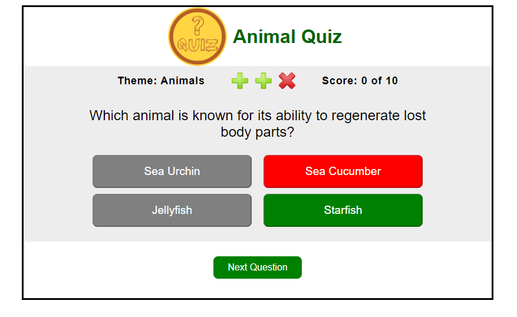

# Animal Quiz
# Animal Quiz
## Introduction
This Animal Quiz objective was to build an interactive front-end site using HTML, CSS and Javascript, that allows users to interact with the site. The purpose of this quiz is to test the users knowledge about animals

## Features

#### Instructions

- Shows the user brief instructions to play the game.

#### Interaction

-The user gets feedback if their selection was correct, and learn what the correct was correct. If a wrong answer is selected, the button turns red and the correct response is shown.

-In the score area, there are three life points. If the user chooses the wrong answer, one of the life points will turn into an X icon  If a user gets three wrong answers, there is a timeout so the user has a chace to see the correct answer before the Game Over screen is displayed.

    

#### Experience
 At the end of the game, users should feel that they want to play again. The are 10 questions in each session so the user can have different questions everytime. These questions are chosen from a pool of 30

### Responsiveness
The games displays correctly in all devices expect mobile devices. I was not able to make it work porperly there.

### Device Testing
I did test the quiz on:
- Desktop: 27 inch desplay
- Laptop:  13 inch display 
- Android Phablet: 7 inch desplay

### Fixes:
1. The "theme" variable was declared incorrectly, and although it worked in the GitPod development environment, the game then did not work when deployed on GitHub. After declaring the variable the game worked. 
2. While developing the game, I would try things out and inadvertently do things like delete and id,rename a class or ID and forget to update the CSS, or wind up with a stray div. I fixed this type of error as I went along.  
3. Via JSHint, I discovered I had forgotten a number of variables and discovered some undeclared variables. 
4. Added a media query to remove the body's top margin from small screens. 

### EBIs (even better if)
- I wanted to add a window.beforeunload function, but learned that it was not possible to create a custom message, so I have changed the instructions instead. 
- As I went through the testing, I felt that there should be more user messages to match the end results. There are now user messages for game finishers with 1 and 2 wrong answers, which appear on the "Game Over" screen. Previously, there had only been messages for any score that was not 15/15 and a for a perfect score.

### Lighthouse
Lighthouse Destop results

Performance was very good according to lighthouse. To improve it i could have converted the images to ".webp"

## Technology

- HTML
- CSS
- JavaScript
- GitPod
- Lighthouse

## Deployment

### Version control
To develop the quiz, I created a repository in GitHub, using a Code Institute Template, and then created a GitPod workspace. Files were uploaded to the GitHub repository by making using of the following commands:
- 'git add . ', which adds files to a staging area before they are committed.
- 'git commit - m "Commit Message"', this commits the changes to a local repository queue.
- 'git push', this sends all the commits in the queue to the GitHub repository.

### Deployment

To create a public link for the game, I took the following steps in GitHub:
- Navigate to settings on the top, horizontal menu bar.
- Click on pages from the left-hand, vertical menu bar.
- Select source, "Deploy from a branch"
- Select branch, "Main", and save

## Resources

- Youtube videos
- StackOverflow
- Mentors in slack
- W3Schools(https://www.w3schools.com/) - As a general reference.
